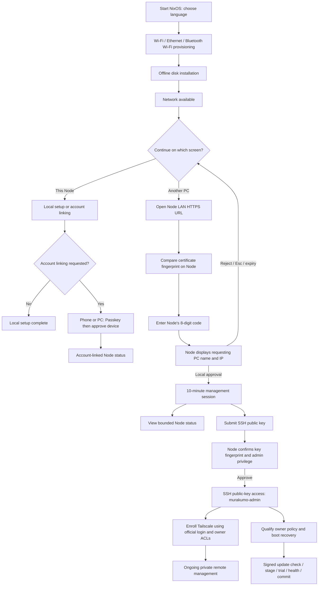

# Node setup and remote management journey

The source implementation adds a locally approved LAN HTTPS pairing window and an administrative SSH public-key path. It is available from the setup menu and after a successful network connection, including a LAN-only connection without Internet. The initial physical installation still requires local disk approval; the LAN manager never formats disks or accepts shell commands over HTTP. Its authenticated HTTP operations are limited to bounded Node status and requesting an SSH public key. An approved SSH administrator can perform normal system administration separately.

The 8-digit code lasts five minutes with five global attempts per window. A correct code only creates a pending request; the Node owner must approve the displayed computer name and IP. The HTTPS session lasts ten minutes and is revoked by Esc, leaving the screen or issuing a new code. Administrative SSH needs a second local confirmation of an Ed25519 key fingerprint. The approved public key persists until removed; removal prevents new connections but does not forcibly terminate already open SSH sessions. Password and root SSH login remain disabled.

The Node has a per-installation self-signed TLS certificate. The owner must compare its SHA256 fingerprint on the Node before trusting it on the managing PC. This first-trust step is a current UX limitation; a numeric code alone cannot authenticate a hostile LAN endpoint. No certificate warning is silently bypassed. URLs use the Node's numeric LAN IP on port 8443. No public reverse tunnel or relay is supplied.

Tailscale is included in NixOS, but this change does not implement account enrollment inside the browser. After approved SSH access, use `sudo tailscale up` and complete its official login into the owner's tailnet; verify owner ACLs and connectivity before claiming ongoing remote access. Tailscale SSH is an additional explicit policy choice, not enabled by this pairing code. Bluetooth is the existing Wi-Fi provisioning path, not a screen-control or shell transport.

Account approval is separate from local administration and remains blocked by the missing original authentication Worker/custody/account-store backup. Local setup and LAN SSH approval do not claim an account, open the vault, qualify inference or authorize an OS update. A Node administrator must separately provision and qualify update trust, owner policy and trial recovery.

Delivery: the source has passed Nix evaluation and is awaiting a new ISO/NAR build, signed publication and physical installation/update. It does not open access on an already installed old Node. Tests passed 110/110; the Grant source bridge used the bundled offline SCI because the shared kbb installation is missing its import-meta-resolve dependency. The old builder boot ISO/base disk were absent. A separate diskless VM instead booted the retained production ISO with installation masked and no NIC. Fixed-revision Nixpkgs evaluation confirmed locked admin password, no root/password SSH login, the approved-key condition and service configuration. Native TLS/fingerprint matching, local IPC approval, denied pre-approval/foreign-origin requests, approved status, SSH public-key installation and closed-session refusal passed with a QA certificate. Chrome passed five fixture workflow checks. Native GTK, the new full NixOS generation/service hardening, certificate generation/browser first-trust, real SSH login, Tailscale enrollment and the photographed Node remain unqualified.
