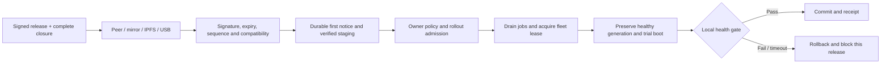

# NixOS / Murakumo Node update lifecycle

2026-10-08. Integrated policy, publishing tools and Linux standalone UEFI updater.
The installer includes conditional services; activation requires locally provisioned
owner configuration and verification keys. No existing Node, production trust root
or USB has been changed. See [operations](update-operations.md) and
[qualification evidence](verification-updates-20261008.md). Production signing,
owner policy UI, fleet coordination and physical hardware recovery remain gates.

## Ownership and layers

- `kotoba-lang/grant`: existing `grant.ota` and `grant.update` plus new
  `grant.update-lifecycle`; pure admission, scheduling and trial health decisions.
- This installer: `nixos/update-release.mjs` verifies exact manifest bytes with
  locally trusted Ed25519 quorum keys; `update-controller.mjs` runs the provider
  boundary with journal CAS, first notice, staging, fleet lease and trial outcomes.
- Linux host provider: bounded streaming delivery, NAR import, flock/fsync journal,
  complete store verification, UEFI one-shot/fallback and boot health recovery.
  Supports standalone Nodes only; fleet role refuses activation.
- Murakumo controller (not supplied): publish signed announcements, staged fleet
  rollout, notifications and independent job-admission consumption of Node policy.

No hosted endpoint has authority to run a command merely because it is reachable.
Release publishing authorization is separate from Node owner and account linking.
Email, Passkey or wallet login does not grant release signing or remote root.

## Normal, semi-mandatory and risky updates

| Condition | Default proposed behavior |
|---|---|
| Routine release, low/medium security risk | Automatic stable update in 03:00–05:00 local maintenance window, after drain; manual mode stages and waits |
| High security risk | Notify immediately; allow postpone within 72 hours from first notice |
| Critical security risk | Notify immediately; allow postpone within 24 hours from first notice |
| Security deadline reached | Stop new fleet jobs, drain existing jobs; trial boot when every safety gate passes, even outside normal window |
| Application risk high/critical | Require explicit reviewed operator authorization; deadline cannot override application risk |
| Invalid signature/metadata | Refuse; never derive quarantine or deadlines from untrusted input |
| Trusted overdue release cannot safely apply | Keep old boot and local maintenance; show blocked reason, restrict new fleet jobs, alert owner |
| Health fail / no health answer by 120 s / two failed boots | Restore previous healthy boot; block release digest; require a new release or explicit retry |

Hours are proposed configurable defaults, not a claim of a vulnerability-specific
remediation SLA. User can disable semi-mandatory policy. Selecting it once is
standing authorization bounded to that channel, risk cap, grace and release keys;
no repeated password is needed. Notifications show remaining time, download size,
reboot impact and postponement choices. “Update now”, “Tonight”, “Postpone until…”
and “Review blocked update” appear on the Node and managing phone/PC; voice
commands request the same actions through the same authenticated policy port.

A publisher cannot shorten the local grace. First-notice time is persisted by
manifest digest before notification and survives reboot/retry. Clock uncertainty
holds activation. A malicious stale announcement cannot move the installed
high-water mark backward. Retain historical notice records across failed trials.
Semi-mandatory is not remote erasure: no format/repartition/password change,
forced job termination or bypass of crypto/recovery. Application risk exception
requires current owner authority and a separate reviewed release approval.

## Distribution and release record

Announce only after immutable source, reproducible/pinned build, complete closure,
signed independent verification receipts and human promotion. Do not introduce
GitHub Actions as a required executor. Canary rollout -> small cohort -> broad
stable release; halt promotion on boot failures. Owner fleet lease permits at
most one concurrent update by default and must be renewed/fenced across reboot.
Do not claim fleet service continuity where no other qualified Node has capacity.

Envelope: base64 exact UTF-8 JSON payload + bounded `signatures` array of
`{keyId, signature}`. Ed25519 signatures cover the exact payload, avoiding
cross-runtime JSON canonicalization. Unique keys count once. Payload schema
`aiueos.release.v1`: sequence, architecture, stable/canary channel, issue/expiry,
securityRisk, applyRisk, optional requiredBy, closure SHA256/byte length, exact
Nix systemPath and hostContract. Transport announcements are untrusted locators.

Provision verification roots/threshold locally; no download replaces its own
trust roots. Rotation requires old-policy quorum authorization, overlap, explicit
key epoch and recovery procedure. The current verifier admits no key-rotation
instruction. USB recovery carries the same signed content. Emergency downgrade
is a separate locally authorized recovery operation, never a signed “new release”
with a smaller sequence. Highest admitted/installed sequence is durable; rollback
does not lower it. Pin failed hashes and retain receipts.

## Provider/journal contract

`policyRequest` maps the signed release into the CLJK JSON policy port
`kotoba-lang/grant/scripts/update-policy.cljk`. Supply kebab-case evidence,
including current owner authority, trusted time, freshness, rollout admission,
complete closure, retained prior generation, qualified recovery, storage capacity,
lease count, drained jobs, maintenance window and explicit consent/defer state.
A true result must mean measured evidence, never a stub in production.

Controller providers must implement:

1. `withLock`, `readJournal`, `casJournal`: privileged exclusive locking,
   generation CAS, atomic rename + file/directory fsync, mode 0600, reject symlinks.
   Journal includes manifest digest, first notice, current/prior paths, filesystem
   UUIDs, sequence high-water, phase, failed hashes and outcome. No Wi-Fi secrets.
2. `fetchClosure`, `importVerifiedClosure`: bounded transport and quota/timeouts,
   SHA256 + length, trusted Nix NAR verification, complete requisites, exact
   resulting systemPath. Real artifacts use streaming; reference tests use buffers.
3. `collectEvidence`, `decide`: build a fresh manifest-bound snapshot, invoke the
   pinned CLJK lifecycle policy. Existing `grant.ota`/`grant.update` remain separate
   libraries, not calls made by this provider. Never accept
   caller-supplied `signature-valid?` from a network message.
4. `acquireFleetLease`, `recheckActivation`: atomic current-owner lease and full
   recheck; drain acknowledgement has a bounded freshness. A reboot must not
   release fencing before boot outcome; process termination uses lease recovery.
5. `prepareTrialBoot`: preserve root/boot UUID kernel parameters and two healthy
   generations, add one-shot trial entry, durable fallback/boot counter and boot
   watchdog. Never change disk partitions. Persist `trial-prepared` first;
   startup reconciles partial writes before doing anything further.
6. `collectLocalHealth`, `decideTrial`, `commitBoot`, `restorePreviousBoot`:
   verify local storage, correct running generation and Node services. Internet,
   registration and remote API outage alone are not boot failure. Commit only
   after local gate; retain prior healthy generations until storage-safe GC.
7. `notify`, `restrictNewJobs`, `drain`: owner notification and scheduler
   enforcement. Local maintenance and private identity keys stay available.

These interfaces are implemented for standalone Linux UEFI Nodes by
`update-linux.mjs`. Fleet job drain, shared leases and scheduler consumption are
not implemented: fleet role refuses rather than asserting those gates. The
controller cannot bypass admission or accept a downloaded shell command. Crash during
trial preparation must resolve to retained boot; crash after commit boot but
before journal completion must reconcile running-generation identity. Rollback
records block the release before changing boot state; recovery clears pending
only after proving the previous generation is running. Do not let a missing
journal reset a high-water mark or silently replace the owner policy.

## UI and observability contract

Node status shows installed/pending version, delivery progress, verification,
first notice/deadline, owner mode, postponement, drain, next reboot, trial and
rollback/blocked reason. Managing device shows the same state and lets authorized
owner change policy. No inference input UI belongs on a Node. Read-only status
must not expose account tokens, device keys or stored Wi-Fi passwords.

Offline installation/local setup remains independent of updates and registration.
Downloads resume without reinstallation. Offline signed USB update uses the same
verification; owner can always enter local recovery. An absent updater displays
“updates not configured”, never “up to date”.

## Acceptance before production enablement

Reference tests cover signed tamper, quorum, replay/sequence, expiry/architecture,
closure corruption, durable notice, policy deadlines, unsafe overdue refusal,
lease recheck and blocked failed trial. They do not qualify a bootloader.

Linux VM must additionally prove power loss at every journal/ESP step, full disk,
missing closure object, bad NAR, two concurrent processes, expired/lost fleet
lease, clock rollback, key rotation refusal, bad generation boot, watchdog reboot,
same-disk fallback, unchanged device/Wi-Fi identity and network-offline health.
Then a signed canary on a dedicated Node must reproduce update and recovery
before enabling a fleet rollout or semi-mandatory timers. Report those outcomes
separately from source tests, ISO builds, USB writes and production deployment.
